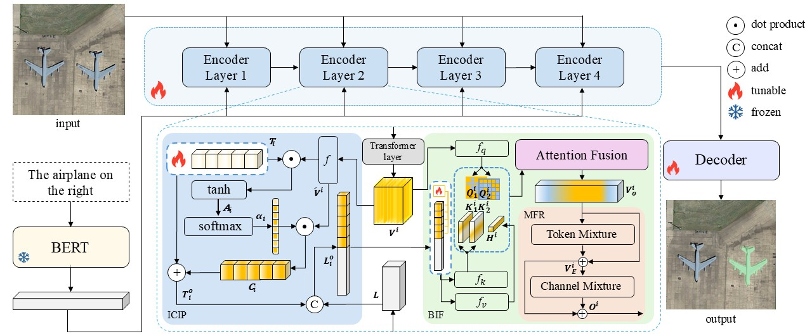

# ICIPNet
This repository is the official implementation for ["Image-Conditioned Instance Prompt Network for Referring Remote Sensing Image Segmentation."](https://arxiv.org/abs/2605.24532)


### Installation

```bash
conda create -n ICIPNet python=3.8 -y
conda activate ICIPNet

# Install PyTorch with CUDA 11.8
pip install torch==2.0.0+cu118 torchvision==0.15.1+cu118 torchaudio==2.0.1 \
    --index-url https://download.pytorch.org/whl/cu118


# Install other dependencies
pip install -r requirements.txt
```

### The Initialization Weights for Training
1. Create the `./pretrained_weights` directory where we will be storing the weights.
```shell
mkdir ./pretrained_weights
```
2. Download [pre-trained classification weights of
the Swin Transformer](https://github.com/SwinTransformer/storage/releases/download/v1.0.0/swin_base_patch4_window12_384_22k.pth),
and put the `pth` file in `./pretrained_weights`.
These weights are needed for training to initialize the model.

## Datasets

We evaluate our method on two referring remote sensing image segmentation datasets: **RefSegRS** and **RRSIS-D**.


## Training

We train the model on **RefSegRS** and **RRSIS-D** with a single GPU.

To train on **RefSegRS**, run:

```shell
python train.py \
  --dataset refsegrs \
  --model_id ICIPNet \
  --epochs 40 \
  --lr 3e-5 \
  --img_size 480 \
  --refer_data_root ./datasets/refsegrs/ \
  --output-dir ./outputs/ \
  -b 4
```

## Testing

To evaluate on **RefSegRS**, run:

```shell
python test.py \
  --swin_type base \
  --dataset refsegrs \
  --resume ./checkpoints/model_best_ICIPNet.pth \
  --split val \
  --workers 4 \
  --window12 \
  --img_size 480 \
  --refer_data_root ./datasets/refsegrs/
```

## Acknowledgements
Code in this repository is built on [RMSIN](https://github.com/Lsan2401/RMSIN). We'd like to thank the authors for open sourcing their project.

## Citation

If you find this work useful, please consider citing our paper:

```bibtex
@misc{ren2026imageconditionedinstancepromptnetwork,
      title={Image-Conditioned Instance Prompt Network for Referring Remote Sensing Image Segmentation}, 
      author={Biaoyu Ren and Qingsheng Wang and Cun Xu and Dingkang Yang and Wenxuan Wang},
      year={2026},
      eprint={2605.24532},
      archivePrefix={arXiv},
      primaryClass={cs.CV},
      url={https://arxiv.org/abs/2605.24532}, 
}
```